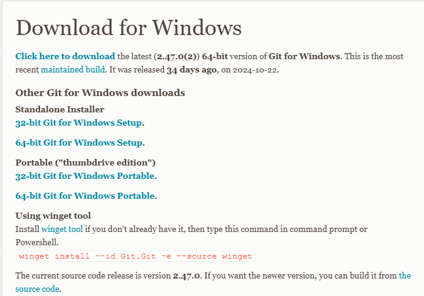
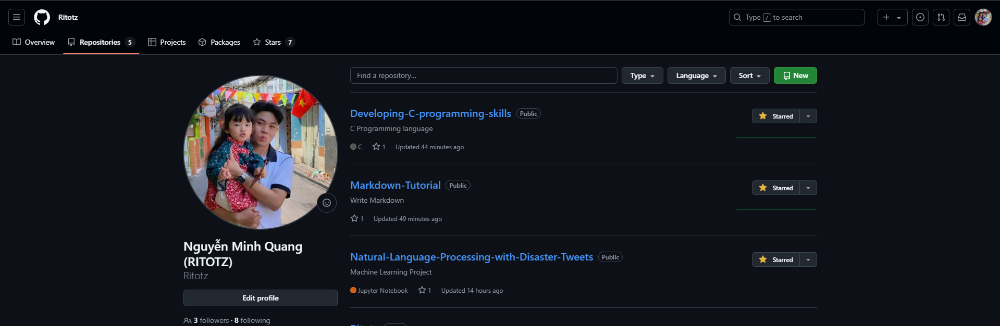
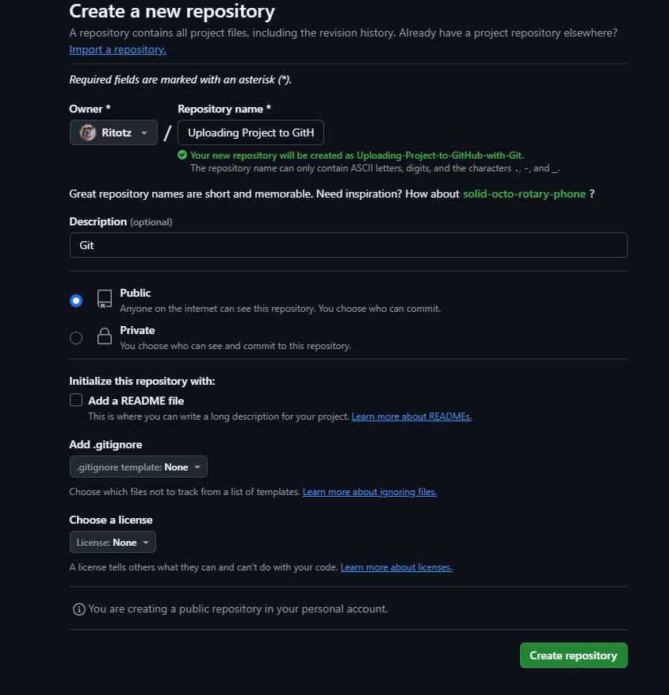
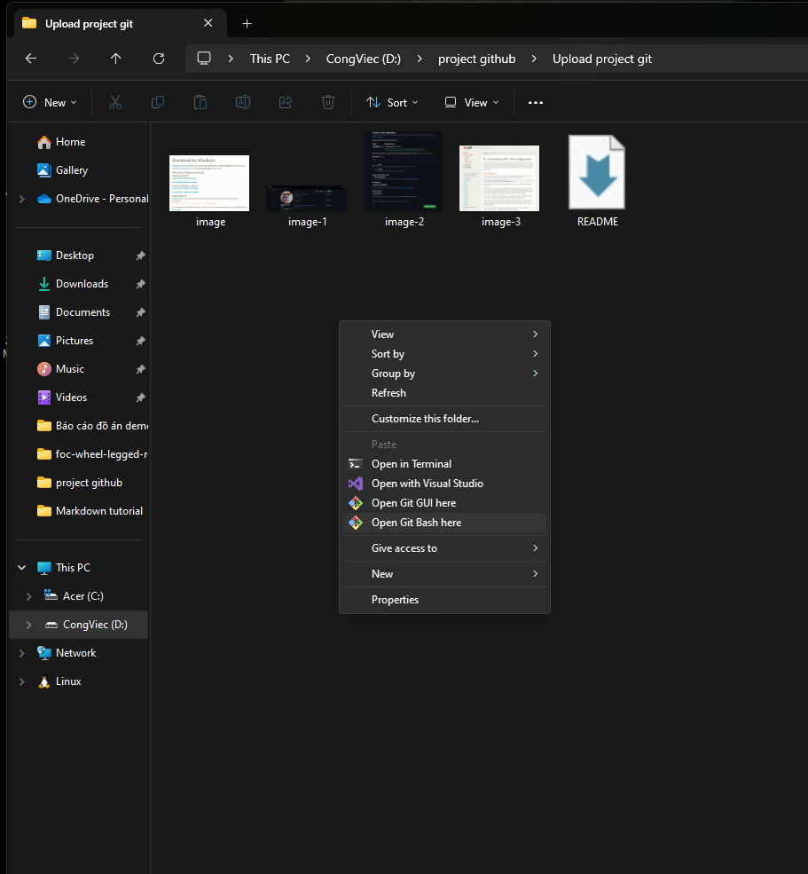
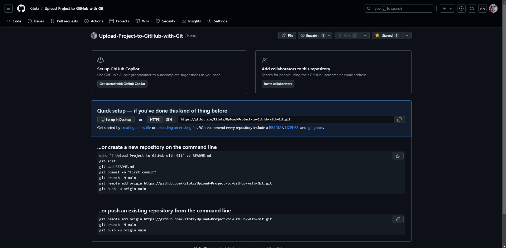
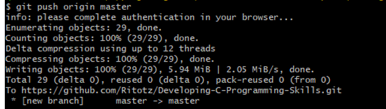

# How to upload github repository with git bash

## Uploading a Github repository using Git (command-line-bash) straightforward. Here's a step-by-step guide:    

### 1. Install Git

<div align="center">
  
</div


> Link download Git:https://git-scm.com/downloads/win

### 2. Create a new repository on Github

> Choose New 

<div align="center">
  
</div

##
> Choose Crete repository

<div align="center">
  
</div

##

### 3. Git bash config gobal

<div align="center">
  
</div

>Link :https://git-scm.com/book/be/v2/Customizing-Git-Git-Configuration

### 4 . Upload project to github

#### 1. Connect git bash

- You can specify Git configuartion settings with the git config command. One of the first things you did was set up your name and email addres:
- Replace with your Email and Github account
```
$ git config --global user.name "John Doe"
$ git config --global user.email johndoe@example.com
```
- Check Connect

```
$ git config --list $
```

#### 2. Upload project to github

##### Step 1: At the local file choose Open Git Bash here

<div align="center">
  
</div

##### Step 2: Upload project
- Initialize Git in the project directory

```
$ git init $
```

- Connect to a Github reponsitory (Choose code at github)

```
$ git remote add origin https://github.com/<username>/<repository-name>.git $
```

<div align="center">
  
</div

- Add files to Git :
  
> Check the status or your files
```
$ git status$
```   
> Add all filles to Git 

```
$ git add . $
```   

- Commint your changes to Git
  
> Commit your changes with a message

```
$ git commit -m"Name commit" $
```

- Push the project to Github
```  
git push origin master
```
<div align="center">
  
</div


